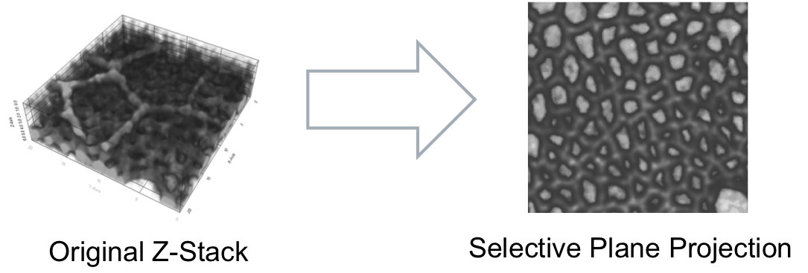

#Selective Plane Projection for Z-Stacks

---------------------------------------
##Summary##

Creates a 2D projection from a Z-stack by selectively choosing from which plane to extract each pixel based on a surface estimation.

---------------------------------------
##Assumptions##

The input image is composed of several z planes representing a cohesive tissue which can be approximated by a 3D surface. In order to exclude another surface from being also projected the latter has to have a lower intensity or at least a smaller number of high intensity points than the region of interest (ROI).

---------------------------------------
##Main algorithm steps:##

1. 1st Surface estimation [1] using the highest intensities in the sample (1st quartile)
2. Application of a cutoff distance to confine the ROI
3. 2nd Surface estimation [1] using the highest intensities in the confined ROI
4. Projection of the Z-Stack on a 2D plane using (3)

---------------------------------------
##Output files in the *Analysis/* folder

| File | Description |
|----|----|
| **ProjIm.mat** | Matlab matrix file containing the projected image for each frame |
| **Surface.mat** | Matlab matrix file containing the original z-plane index for each pixel in *ProjIm.mat* |
| **vtk/gridfit_frame_###.vtk** | Surface files for every frame containing the coordinates of the 2nd gridFit estimation in ASCII format (1 grid point per line: x,y,z) (see [CellSurface plugin](../Icy_Plugins/05_CellSurface) for further usage) [ ! _output added starting from version 2.1.5_ ]|

---------------------------------------
##Parameters##

`Parameter: Smoothing Radius`

* Defines the amount of gaussian blur to be applied on the image before estimating the surface (the original image data is preserved for the modules to follow).
* Selecting a higher amount of blurring will make the image smoother but mask the details.
* units [pixels]
* recommended range [0.1 - 5]

`Parameter: Surface Smoothness 1`

* Input parameter for the first gridFit© estimation of the highest intensity surface.
* Selecting a larger value will make the surface smoother but less accurate. The parameter should be tuned such that the surface is detailed enough to capture the ROI but without containing points from the outer region (e.g. visualized by spike-like departures). 
* units [positive scalar]  
* recommended range [30 - 100]

`Parameter: Cutoff distance`

* Defines the region of interest in absolute terms from the first estimated surface.
* Selecting a larger cutoff distance will include more signal from above and below the estimated surface. It is important that the filtered set of high intensity points should include only signal from the ROI. 
* units [z-plane distance]  
* recommended range [1-3, decimals allowed]

`Parameter: Surface Smoothness 2`

* Input parameter for the 2nd gridFit© estimation of the intensity surface.
* This surface estimation is based only on the points from the previous part (2) and can therefore be more detailed, i.e. less smooth. It is important to estimate the detailed morphology to ensure that the correct plane is extracted for every pixel location of the ROI.
* *units* [positive scalar]  
* *recommended range* [20-50]

---------------------------------------
##Debugging##

* Turn this switch on to see the intermediate estimated surfaces.
* **Warning!** Do only apply on single stacks generates a lot of images.

---------------------------------------
##References##

* [1] [Surface Fitting using gridfit by John D’Errico](http://www.mathworks.ch/matlabcentral/fileexchange/8998-surface-fitting-using-gridfit)

---------------------------------------
######  Do you think these informations are not enough to help you? Drop a line to the author and he will extend this tutorial asap!

###### This page was written by [Davide Heller](mailto:davide.heller@imls.uzh.ch) on 10.11.15@17:40

