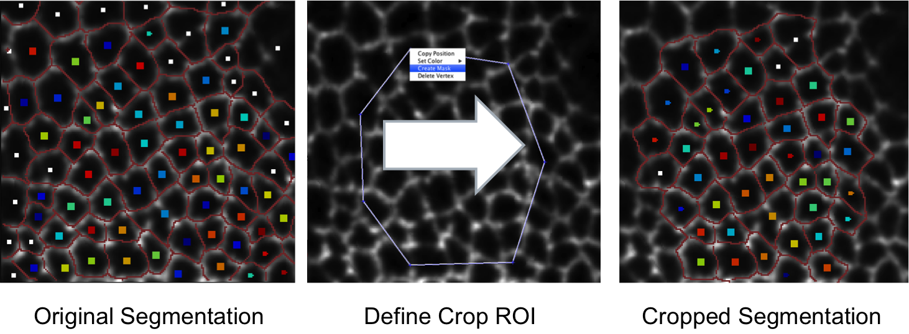

#Polygonal Mask#

---------------------------------------
##Summary##
Create a polygonal mask to ease the correction step (hide labels and seeds that are not within the mask) and allow cropping the final skeletons if desired.

---------------------------------------
##Assumptions##
To create the mask the segmentation module has to be run first in order to have the cell labels.

---------------------------------------
##Usage##

The ui interaction is build upon the *roipoly* MATLAB tool. Behavior as described in the MATLAB documentation:

>Use roipoly to specify a polygonal region of interest (ROI) within an image. roipoly returns a binary image that you can use as a mask for masked filtering.

>With the polygon tool active, the pointer changes to cross hairs when you move the pointer over the image in the figure. Using the mouse, you specify the region by selecting vertices of the polygon. You can move or resize the polygon using the mouse. 

>When you are finished positioning and sizing the polygon, create the mask by double-clicking, or by right-clicking inside the region and selecting *Create mask* from the context menu.

---------------------------------------
######  Do you think these informations are not enough to help you? Drop a line to the author and he will extend this tutorial asap!

###### This page was written by [Davide Heller](mailto:davide.heller@imls.uzh.ch) on 10.09.14@17.08

