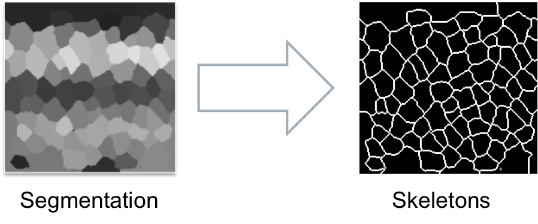

#Skeleton Generation#

---------------------------------------
##Summary##
The cell label data structure is transformed into binary skeletons for every frame. A skeleton depicts the boundaries between cells with a white 1 pixel line (255) over black background (0). File format is PNG.

---------------------------------------
##Assumptions##
The segmentation module needs to be run before this module

---------------------------------------
##Parameters##

`Parameter: Use Polygonal Mask`

* Allows to crop the skeletons before saving them by applying the polygonal mask created beforehand.
* *Additional requirement*: polygonal mask module

`Parameter: Use Corrected Segmentation`

* Allows to use the corrected segmentation results instead of the first segmentation results. 
* *Additional requirement*: Tracking & Re-Segmentation Module 

---------------------------------------
######  Do you think these informations are not enough to help you? Drop a line to the author and he will extend this tutorial asap!

###### This page was written by [Davide Heller](mailto:davide.heller@imls.uzh.ch) on 10.09.14@17.08

