# Generating overlays using CellOverlay
---

After installing the plugins and loading the test file we are now ready to generate overlays. In fact two overlay are already present if we look at the ***Layer*** menu in the icy menu on the right. By clicking on the eye icon on the side of each overlay you can toggle the presence.

For a general overview you can watch our first CellOverlay [tutorial video](https://www.dropbox.com/s/m1um7hdl26h5iqi/04_CellOverlay_introduction_area.mov?dl=0) too!

	Notice: This example uses the original skeleton image as background but the overlays can be generated on any other image as well (e.g. raw image, second channel ecc.) the only limitation is that dimensions must match (x,y,t).

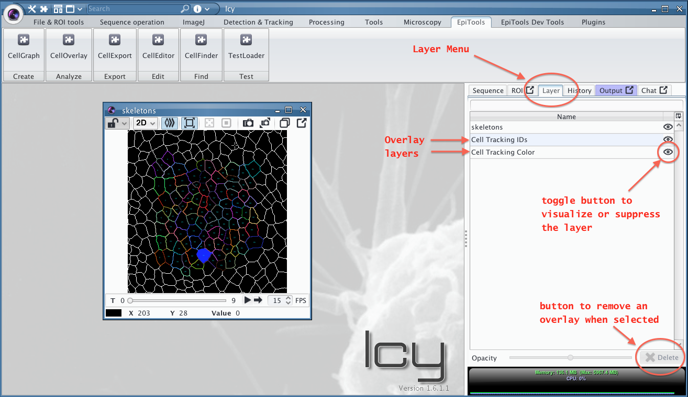

### Create a new overlay 
---

Let's add a new overlay to the test viewer (click again on TestLoader if you closed it). Here we will add a graph view overlay which visualizes the neighborhood connectivity of every cell.

1. Open the CellOverlay plugin from the toolbar
2. Select _GRAPH VIEW_ from the Overlay list (see summary figure below)
3. Generate the overlay by clicking _Add Overlay_ on the plugin bottom

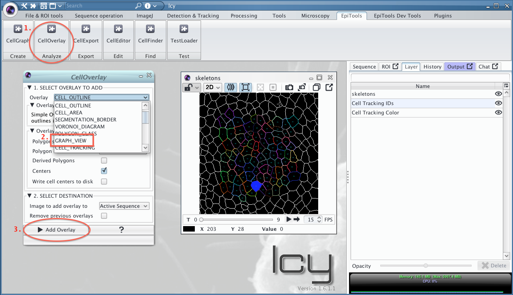

A new overlay is now present on the image and a new entry in the Layer menu:

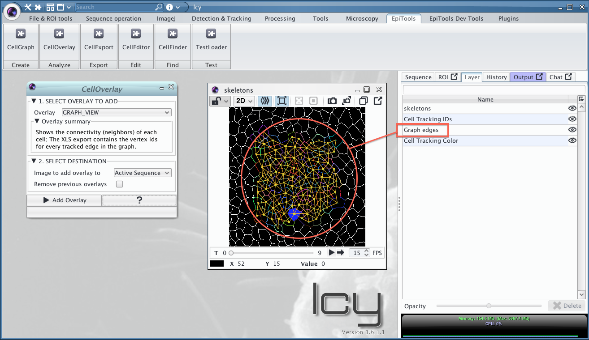

### Adjusting a gradient color overlay
---

When the overlay displays a gradient through a color scheme like in the Area example the user can adjust the scheme through the 4 parameters in the OptionPanel in the Layer menu (see image below). The _Gradient Maximum_ and _Gradient Minimum_ parameters set the extremes of the gradient (everything above and below has constant color). The _Gradient Scale_ is a multiplier between 0 and 1 to scale the color gradient into a particular range of colors (see [HSV color scheme](https://en.wikipedia.org/wiki/HSL_and_HSV) for more information about the color space). The _Gradient Shift_ is complementary to the scale, shifting the scaled color gradient into the desired region by adding a constant factor between 0 and 1.

Current Overlays with Color Gradient:

* Area Gradient
* Voronoi Area Difference
* Division Orientation
* Ellipse Elongation Ratio
* Ellipse Fit With respect to ROI
* Edge Intensity

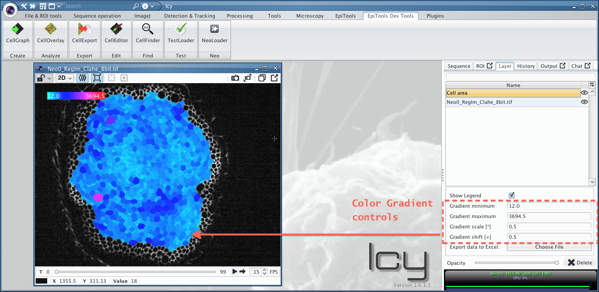

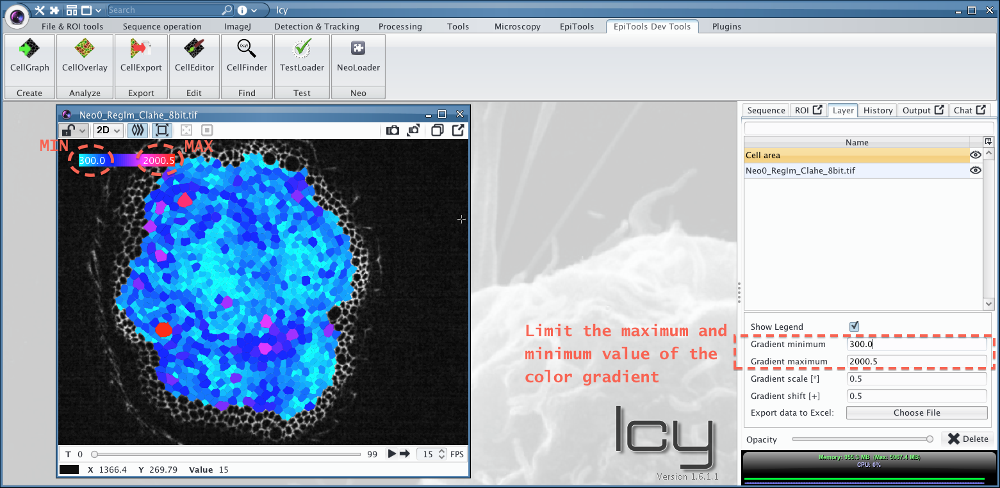

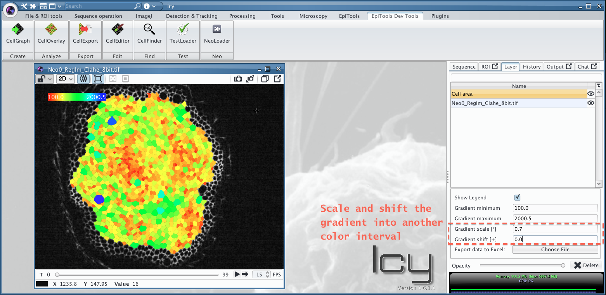

### Export an overlay
---
While in the later section [CellExport](../03_CellExport) we show how to export many data points at once, every overlay has a custom export option. This option can be reached from the layer option menu, where you can also adapt the opacity or delete the overlay. Here we show howt exprot the area of cells from the CELL_AREA overlay:

1. Click on the layer name to make the export option appear
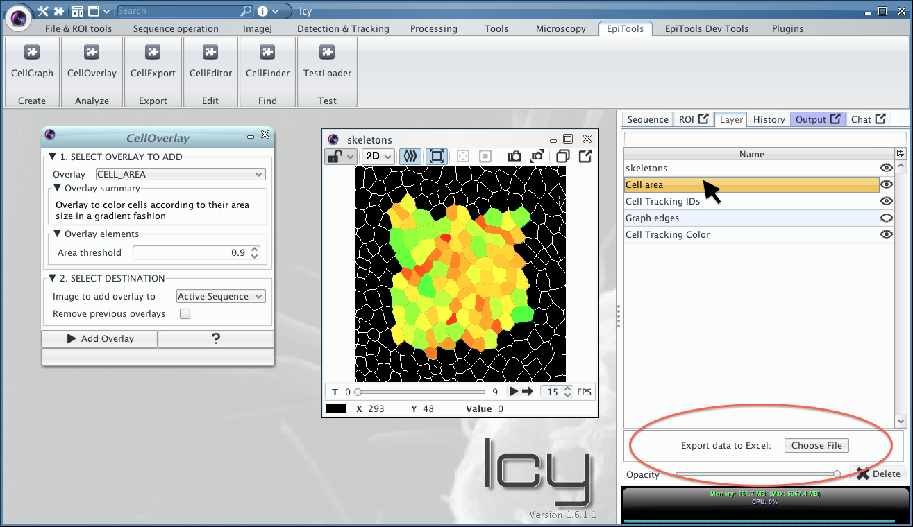
2. Click on the export button and choose where to save the spreadsheet
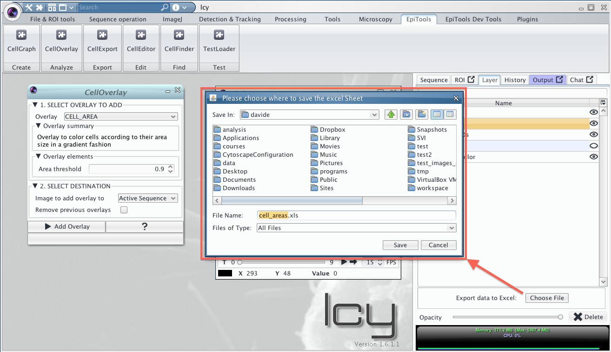
3. Every sheet in the file will contain the area of the cells in the respective frame
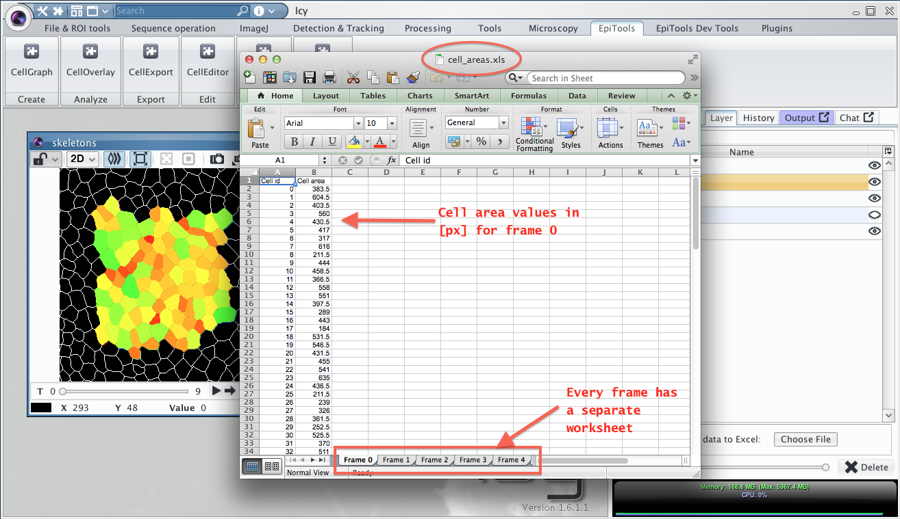

### Available Overlays
---

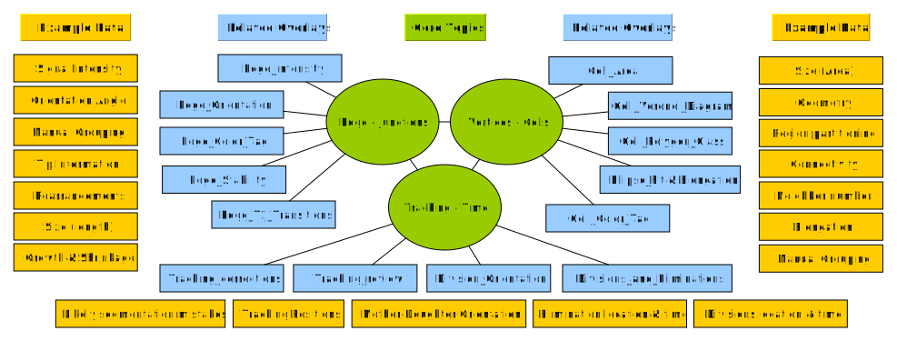

Currently the following overlays are available, divided by category:

#### Basic

| CELL_OUTLINE  | CELL_AREA | CELL_SEGMENTATION_BORDER |
|----|----|----|
| 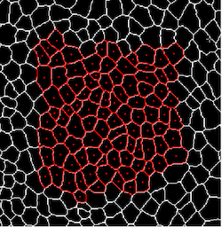 | 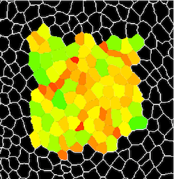 | 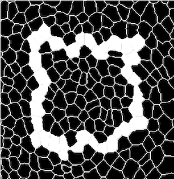 |
| Draws cell centroids and cell outlines in a color of choice | Colors the cells according to their area size in a gradient fashion. Gradient threshold can be dynamically changed, just move the pointer to back to the image to refresh | Shows where the border of the segmentation was identified | 
||[tutorial video](https://www.dropbox.com/s/m1um7hdl26h5iqi/04_CellOverlay_introduction_area.mov?dl=0)||

#### Tesselation

| CELL_VORONOI_DIAGRAM  | CELL_POLYGON_CLASS | CELL_GRAPH_VIEW |
|----|----|----|
| 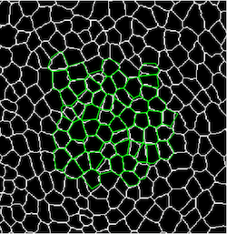 | 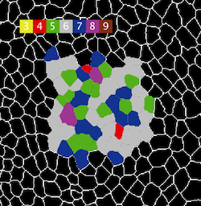 | 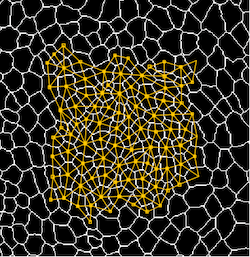 |
| displays the voronoi diagram computed from the cell centroids | Displays the number of neighbors each cell has with color code or number | Shows the connectivity (neighbors) of each cell |
||[tutorial video](https://www.dropbox.com/s/303r7zknp4ydecp/05_CellOverlay_polygonClass.mov?dl=0)||
	
#### Dynamic (tracking required)

| TRACKING_REVIEW  | TRACKING_DISPLACEMENT | DIVISIONS_AND_ELIMINATIONS |
|----|----|----|
| 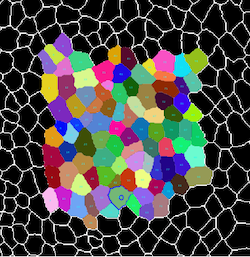 | 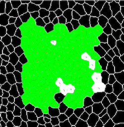 | 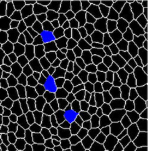 |
| Reviews the tracking in case it has been eliminated or to highlight different aspects | Shows how much a centroid moved from one frame to the next. Helpful to spot mistakes | Highlights the cells that underwent division or elimination during the time lapse |
|[tutorial video](https://www.dropbox.com/s/p9bdzmsik1ihj3i/06_CellOverlay_Tracking.mov?dl=0)|----|[tutorial video](https://www.dropbox.com/s/9jdaq141teina4x/07_CellOverlay_Divisions_and_Eliminations.mov?dl=0)|

#### Interactive

| CELL_COLOR_TAG | EDGE_COLOR_TAG |
| --- | --- |
| 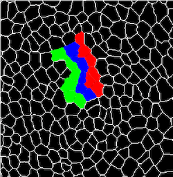 | 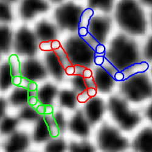 |
| Interactively mark cells with several colors of choice and follow the cells over-time | Interactively mark edges with several colors of choice and follow the edges over-time |
|[tutorial video](https://www.dropbox.com/s/kaphn9pzffmthan/08_CellOverlay_Cell_Color_Tag.mov?dl=0)|[tutorial video](https://www.dropbox.com/s/osxd1tzri6gpdg4/09_CellOverlay_Edge_Color_Tag.mov?dl=0)|

#### Edge / Junction Analysis

| EDGE_T1_TRANSITIONS  | EDGE_STABILITY | EDGE_INTENSITY |
|----|----|----|
| 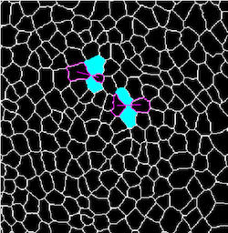 | 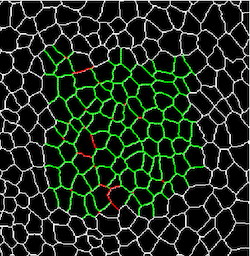 | 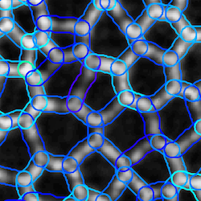 |
| Computes and displays the T1 transitions present in the time lapse | Displays a color code for how stable edges are, how long they can be tracked | Transforms the edge geometries into ROIs and displays the underlying intensity of the image |

#### Shape analysis

| ELLIPSE_FIT  | ELLIPSE_ELONGATION_RATIO | ELLIPSE_FIT_WRT_POINT_ROI |
|----|----|----|
| 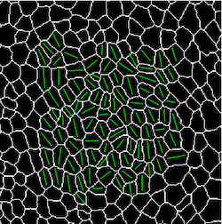 | 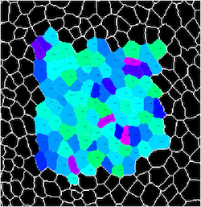 | 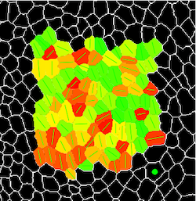 |
| Fits an ellipse to each cell geometry and displays the longest axis | Color codes the cell according to their elongation ratio and writes the elongation factor within every cell | Highlights the orienation of the cell with respect to a user defined ROI (green point). The ROI can be interactively moved |
|||[tutorial video](https://www.dropbox.com/s/jnx6nujcnr0asxr/10_CellOverlay_EllipseFit_ROI.mov?dl=0)|

#### Futher overlays
	
* DIVSION_ORIENTATION: Color codes the dividing cells according to their new junction orientation (Longest axis of mother cell vs New junction)
* TRACKING_STABLE_ONLY: Outlines the cells that are completely tracked throughout the movie or till the division
* TRACKING_CORRECTION_HINTS: Help identifying cells which have been segmented wrongly, best used in combination with [CellEditor](../03_CellEditor) plugin
* EDGE_ORIENTATION: useful to extract orientation of individual edges with combined intensity measurement
* CELL_PROJECTION: see [CellSurface section](../05_CellSurface)

**Learn how to load your own graph structure into memory in the [next section](../02_CellGraph)**

---
######  Do you think these informations are not enough to help you? Drop a line to the author and he will extend this tutorial asap!

###### This page was written by [Davide Heller](mailto:davide.heller@imls.uzh.ch) on 12.11.2015@15:37

