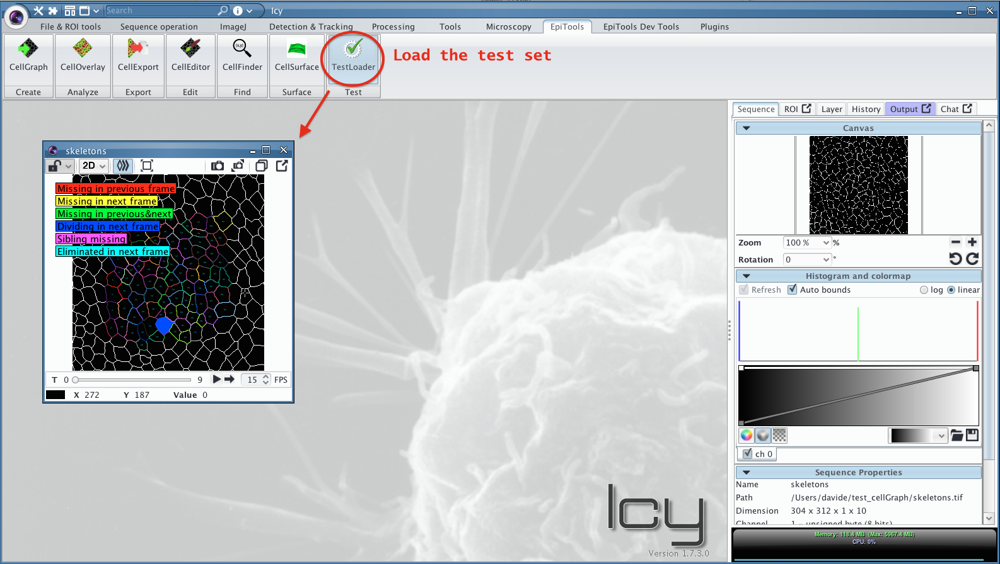
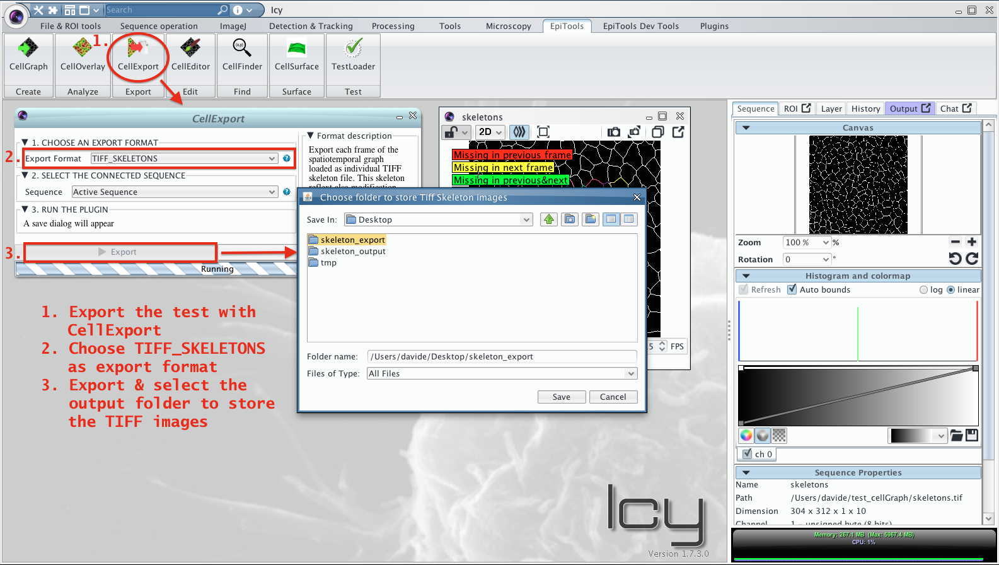
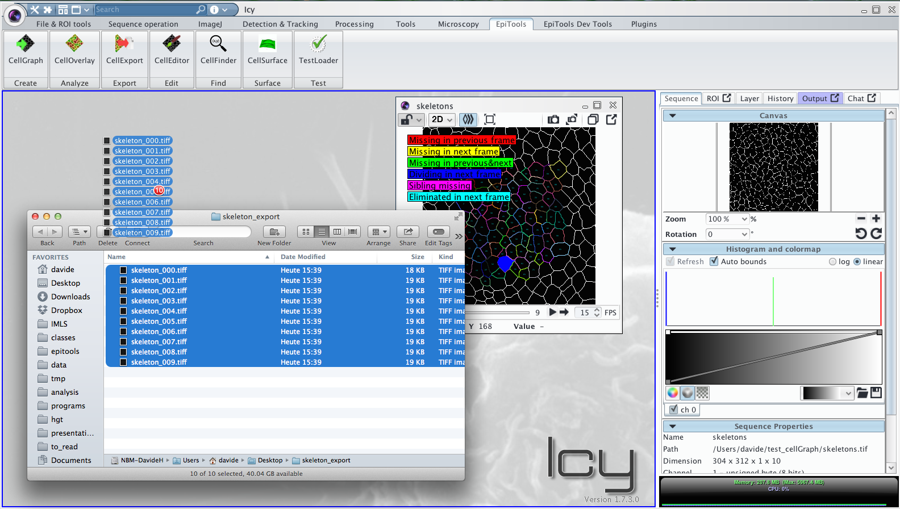
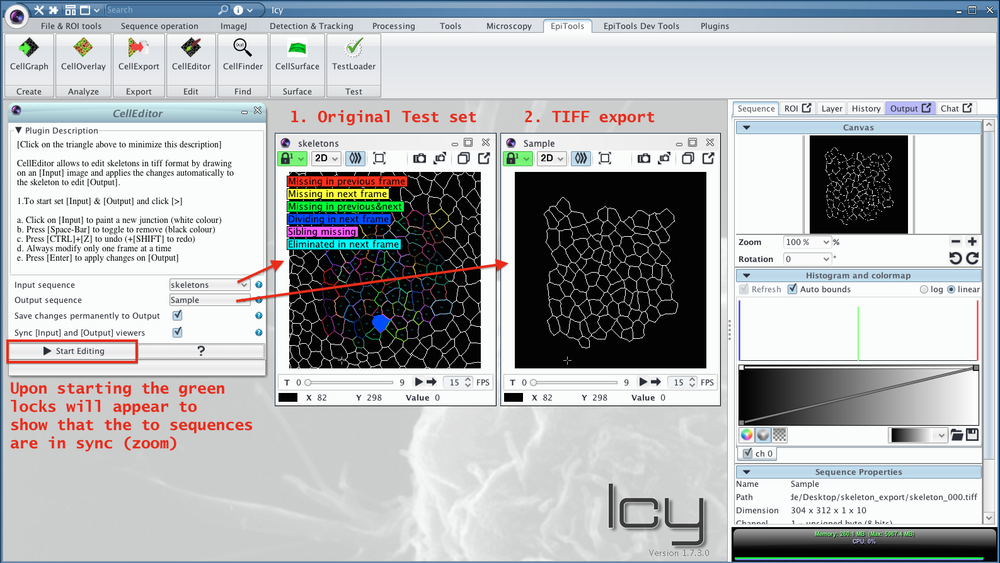
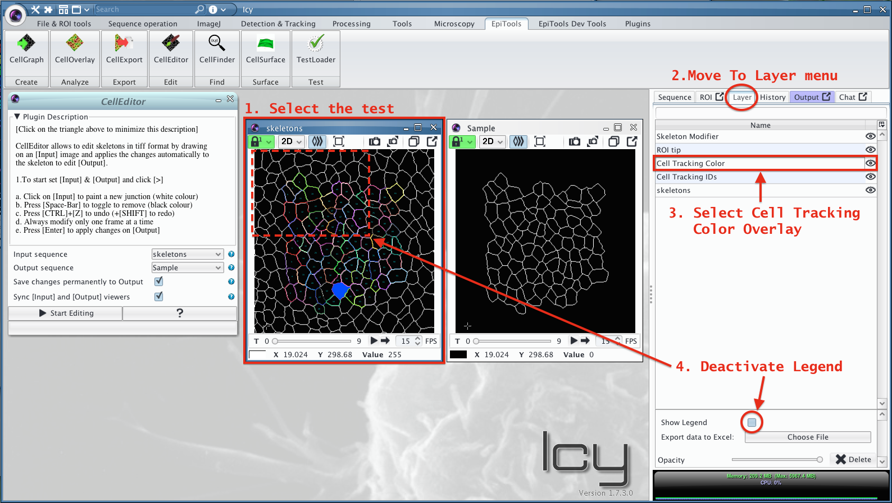
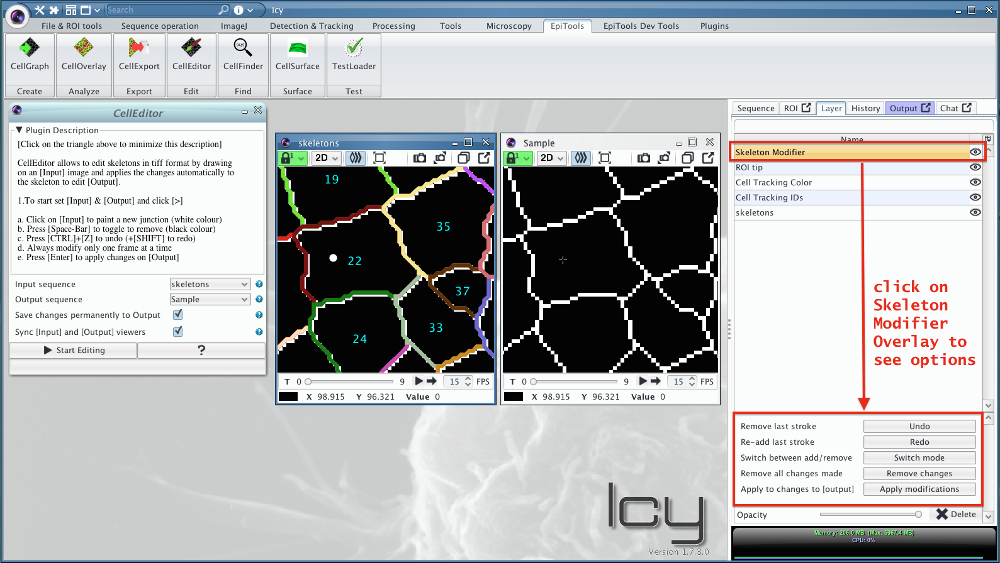
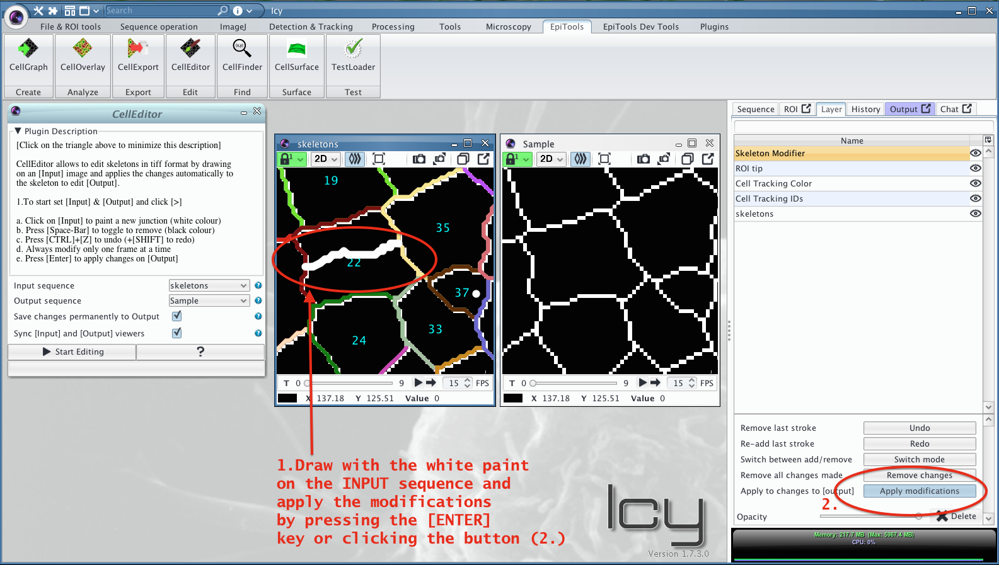
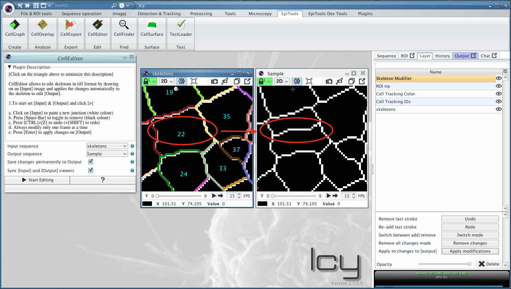
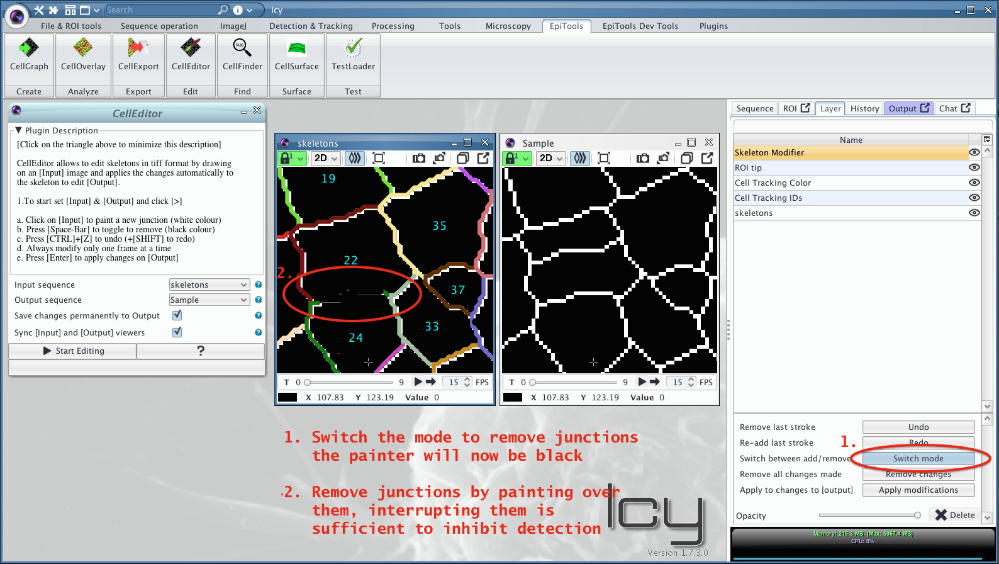
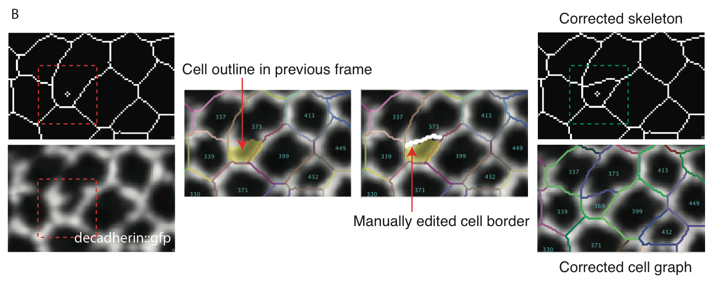

# Modifying Skeleton Images with CellEditor
---------------------------------------

CellEditor allows to manually correct skeleton images by simple painting tools.

	Please make sure to backup your skeletons before modifying them permanently!
	
	The layer option menu shown in the tutorial has been added in version 0.8.9

The following tutorial shows how to modify the test set included in EpiTools.

### 1. Load the test set

Load the test set included in the zip file of the EpiTools plugins for icy by clicking on the relative icon or (in case the workspace was not installed) by searching TestLoader.

### 2. Export TIFF skeletons

To edit the skeletons we need to obtain TIFF images. Any loaded skeleton set can be saved as TIFF sequence through the [CellExport](../03_CellExport) plugin, choosing the option TIFF_SKELETONS.

### 3. Import TIFF skeletons

Drag the images inside icy to open the exported TIFF images as sequence.

### 4. Setup CellEditor

The CellEditor plugin needs to sequence: (1) the INPUT sequence on which to draw and (2) the OUTPUT sequence on which to apply the modifications. After setting the options accordingly start the plugin.

### 5. Deactivate Legend

This step is optional but in case a legend is blocking the sequence visualization it can be deactivated in the relative overlay. For this select the INPUT sequence move to the Layer menu and select the Cell Tracking Color Overlay. Now deactivate the Show Legend checkbox to suppress the visualization.

### 6. Access modification overlay

By having started the CellEditor Plugin, a new overlay was added to the INPUT sequence. By selecting the latter you should see the relative option menu.

### 7. Add a cell junction

Cell junctions can be added by painting with the white color on the INPUT sequence. Upon clicking apply or pressing the ENTER key, the modifications will be transferred to the OUTPUT sequence.

### 8. Remove junctions

To remove junctions the painting mode (WHITE or BLACK color) has to be switched to black. When applying the black paint through ENTER or button, the skeleton will be cut in those parts. Note that it is sufficient to create a small gap in the skeleton to suppress the cell detection.

### (optional) Use the correction overlay

To spot segmentation mistakes we offer the TRACKING_CORRECTION_HINTS overlay in the [CellOverlay](../01_CellOverlay) plugin. The overlay uses the tracking information to highlight cells that are absent from previous frames.

---------------------------------------

######  Do you think these informations are not enough to help you? Drop a line to the author and he will extend this tutorial asap!

###### This page was written by [Davide Heller](mailto:davide.heller@gmail.com) on 22.04.2016@20:00

