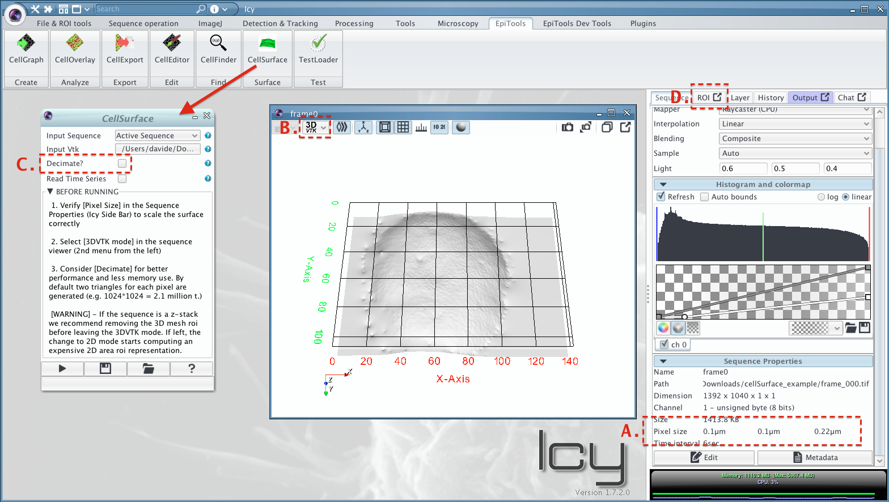
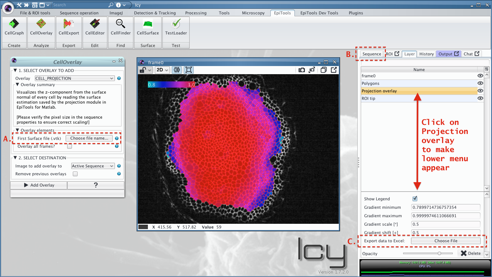

# Visualizing GridFit© Surfaces with CellSurface and CellProjection
---------------------------------------

## Assumption

The [selective plane projection module](../../Analysis_Modules/00_projection) from the EpiTools app for Matlab was used (version > 2.1.5). The latter automatically saves ASCII files containing the 2nd estimated surface by GridFit© [1]. 

The surface/height map files can be found in the *Analysis/* folder under *vtk/gridfit_frame_###.vtk*. Every line in these files represents a coordinate in the surface grid (i.e. x,y,z). Starting from EpiTools plugins for icy [version 0.8.7](../../Support/Latest_News) we provide two tools to use these files, one to visualize the surface as 3D rendering (CellSurface) and the other to evaluate the position of cells in 3D (CellProjection overlay).

We provide example files [here](http://imls-bg-arthemis.uzh.ch/epitools/files/samples/cellSurface_example.zip) to generate the visualizations below.

## CellSurface

**Requisites:** icy plugin 3D Mesh ROI plugin [2]

The *CellSurface* plugin visualizes the height map as 3D rendering, leveraging on the 3D Mesh ROI plugin [2] and the VTK library [3] integrated in icy. Time series are supported by assigning individual ROIs to specific frames, allowing the user to inspect the morphological changes of the surface over time.

To load our example:

 1. Open *frame_000.tif* and the CellSurface plugin
 2. Set *gridfit_frame_000.vtk* as input vtk file
 2. Verify the pixel size in the Sequence Properties (Icy Side Bar) to scale the surface correctly, for the example it should be (x = y = 0.102um) and (z = 0.219um) see (A.) 
 2. Select 3DVTK mode in the sequence viewer (2nd menu from the left) (B.) 
 3. Try the decimate option for better performance and less memory use in case of time series (C.) 
 4. Run the plugin (triangle)
 5. The Surface can be saved as *ROI XML file* in the ROI menu (D.)
 
For more information about the decimation method visit the dedicated [vtk documentation page](http://www.vtk.org/doc/nightly/html/classvtkDecimatePro.html)

` [WARNING] Currently we do not support registered data as the translation is applied after surface export` 
` [WARNING] If used on a z-stack, leaving the 3DVTK starts cpu intesive computation by 3D mesh roi plugin to adapt the ROI in 2D, to avoid this we suggest removing the ROI beforehand.`

## CellProjection

The *CellProjection* overlay for the [CellOverlay plugin](../../Icy_Plugins/01_CellOverlay) visualizes as color gradient the magnitude of the z-component from the surface normal of every cell. The overlay uses the estimated height map to assign z-coordinates to all coordinates of the cell’s polygon. To compute the apporximated 3D surface normal for every cells we use Newell’s method [4]. The z-component of the surface normal is useful to estimate the area projection bias through the proportional dependence between 3D and projected 2D area [5]. All values can be exported in an excel sheet through the layer options menu in icy.

To load our example:

1. Open *frame_000.tif* and the [CellGraph plugin](../../Icy_Plugins/02_CellGraph)
2. Choose FileType WKT and set *skeleton_000.wkt* as first time point. 
3. Run the plugin and a red outline should appear on the sequence (see figure 1)
4. Open [CellOverlay plugin](../../Icy_Plugins/01_CellOverlay) and select CELL_PROJECTION as Overlay
5. Set *gridfit_frame_000.vtk* as first surface file (A.)
6. Verify the pixel size in the Sequence Properties (Icy Side Bar) to scale the surface correctly, for the example it should be (x = y = 0.102um) and (z = 0.219um) (B.)
6. Run the plugin (i.e. add the overlay on the sequence)
7. Export an XLS sheet with the information for every cell in the Layer Option menu (C.)

An example output excel sheet can be found in the example dataset.

## Example files

The example surface data set contains the following files

| File | Description |
|----|----|
| **frame_000.tif** | Projected image of wing disc sample with pixel size (x = y = 0.102um) and (z = 0.219um)  |
| **skeleton_000.wkt** | Segmentation line saved with CellExporter for faster loading |
| **border_000.wkt** | Segmentation border saved with CellExporter for faster loading|
| **gridfit_frame_000.vtk** | Surface file for frame_000.tif containing the coordinates of the 2nd gridFit estimation in ASCII format (1 grid point per line: x,y,z) |
| **cell_projection_overlay.xls** | Example excel output sheet containing the compents of the unit surface normal for every cell in teh skeleton |

## References

1. [Surface Fitting using gridfit by John D’Errico](http://www.mathworks.ch/matlabcentral/fileexchange/8998-surface-fitting-using-gridfit)
2. Plugin by Alexandre Dufour, available at: [http://icy.bioimageanalysis.org/plugin/3D_Mesh_ROI](http://icy.bioimageanalysis.org/plugin/3D_Mesh_ROI), to install it simply use the [icy search bar](../../Icy_Plugins/00_Installation)
3. [http://www.vtk.org](http://www.vtk.org)
4. Sutherland, Evan E., Robert F. Sproull, and Robert a. Schumacker. 1974. “A Characterization of Ten Hidden-Surface Algorithms.” ACM Computing Surveys 6 (1): 1–55. doi:10.1145/356625.356626
5. John M. Snyder and Alan H. Barr. 1987. Ray tracing complex models containing surface tessellations. ACM Computer Graphics 21 (4): 119-128. doi:10.1145/37401.37417

---------------------------------------

######  Do you think these informations are not enough to help you? Drop a line to the author and he will extend this tutorial asap!

###### This page was written by [Davide Heller](mailto:davide.heller@imls.uzh.ch) on 10.11.2015@20:00

