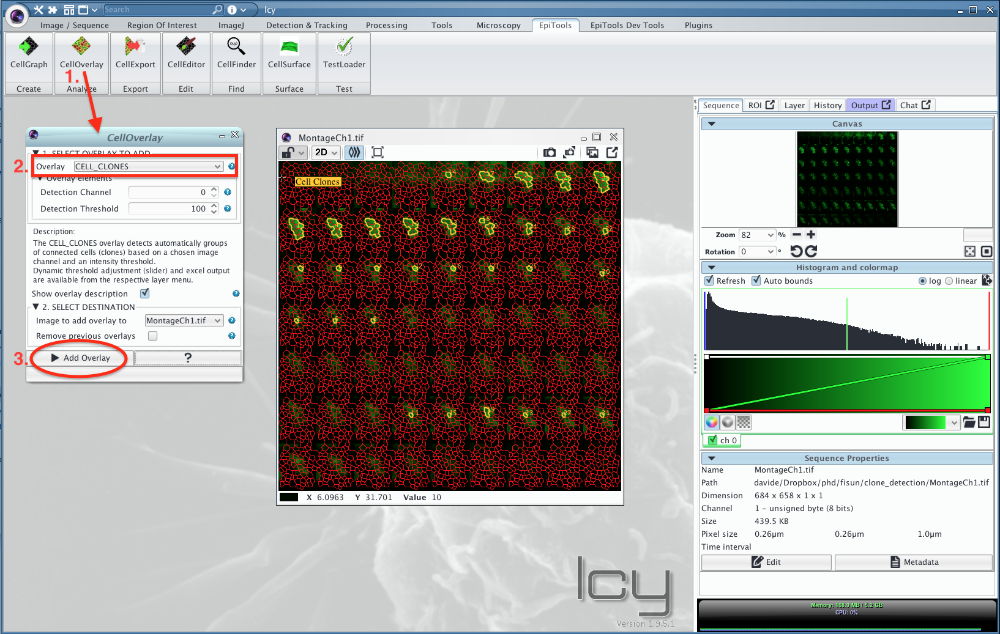
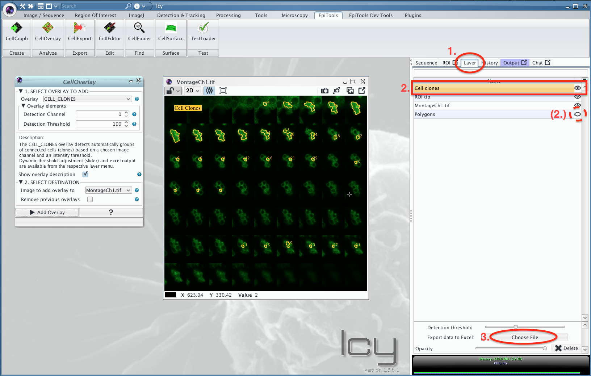
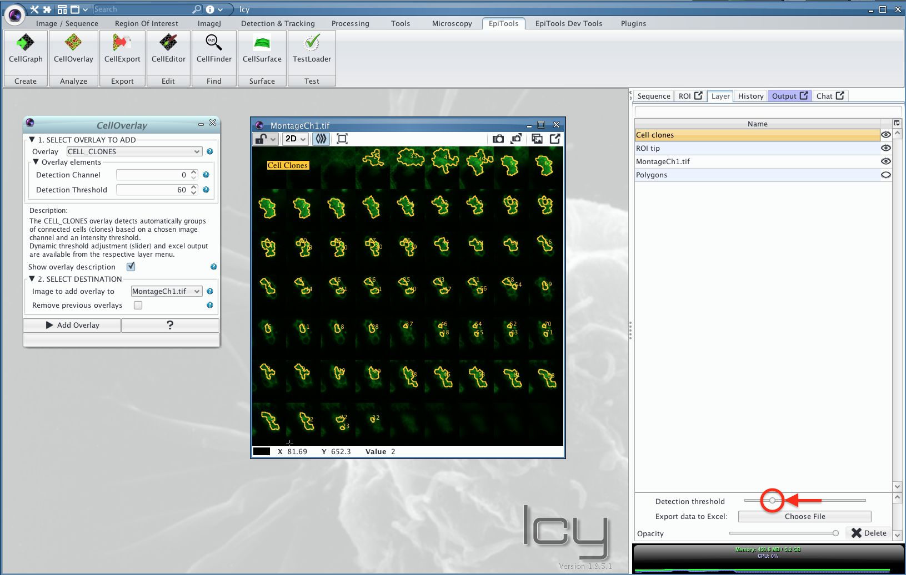

# Detecting Cell Clones
---------------------------------------

## Summary

The **CELL_CLONE** overlay (added in v0.9.1) in the CellOverlay plugin detects the outlines of cell subpopulations (clones) based on a secondary input channel. The detection works as follows:

For every cell geometry, the mean intensity is measured within the cell geometry from the selected channel (the image can have multiple channels but the detection will only consider one currently). Given a user defined threshold (by default 100, currently limited to 0-255 <-> 8 bit image), the cells above the threshold are selected and create a subset from the cell network. By using a network property called "connected components" all the connected subgroups (clones) are identified and visualized.The threshold can be dynamically adjusted with the slider, the channel is fixed once the overlay is created. 

## Export

The excel export accessible through the layer option menu (see example below) currently includes:

* clone_id (increasing integer)
* centroid coordinates of the clone geometry
* size/area (in pixel)
* perimeter (in pixel)
* cell count (# of cells within clone)
* border count (# of cells on the border of the clone)
* neighbor count (# of cells on the other side of the border, i.e. neighboring the clone)
* detection channel (in case the channel in the image has a name)
* the used detection_threshold.

## Example workflow

1. download the *cellClone_example.zip* from the [epitools_samples](https://github.com/epitools/epitools-samples) repository

1. open MontageCh1.tif in icy and overlay the skeleton with the CellGraph plugin by specifying the MontageSkeleton.tif as input file

3. Add the CELL_CLONES overlay from the CellOverlay plugin 

4. From the layer menu choose the "Cell Clones" layer and select the export button from the menu at the bottom to save the excel file (an equivalent example excel file is included in the archive)

5. (Optional) switch off the red polygon_layer by clicking the eye symbol next to the "Polygons" layer

6. (Optional) adjust the detection_threshold dynamically by moving the slider above the export button 

## Source Code

The JAVA code for this overlay can be found here: [CellGraph/src/plugins/davhelle/cellgraph/overlays/CellCloneOverlay.java](https://github.com/epitools/epitools-icy/blob/master/CellGraph/src/plugins/davhelle/cellgraph/overlays/CellCloneOverlay.java)

## Acknowledgements

Thanks to the Fisun lab @ EPFL for the idea of developing this overlay, the example data and helping testing it!

---------------------------------------

######  Do you think these informations are not enough to help you? Drop a line to the author and he will extend this tutorial asap!

###### This page was written by [Davide Heller](mailto:davide.heller@gmail.com) on 26.7.2017@16:24

