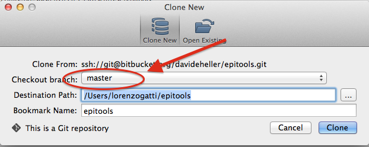
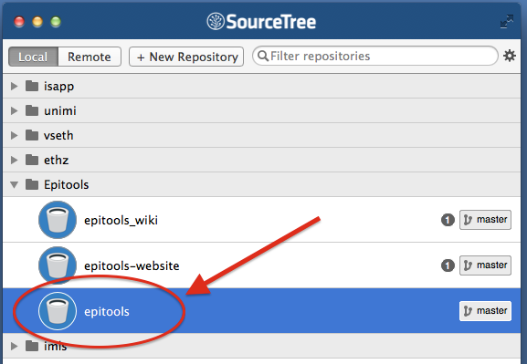
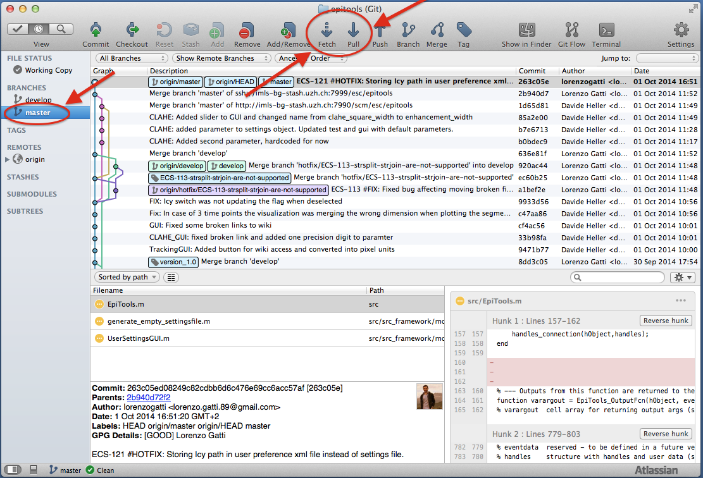

# Installation
---------------------------------------

EpiTools comes in a single flavour as software package for Matlab. We suggest to use the lastest Matlab version available (2014a) since we developed and tested for retrocompatibility only for a small number of old Matlab releases.
At this time of the developing plan, you will still need a full and licenced installation on Matlab since our program is just a wrapped ensamble of matlab and c++ functions working together. 

## How to install it and receive our latest patches or updates

---------------------------------------
#### Installing EpiTools from our website

From the [home page](https://epitools.github.io) of EpiTools you can easily download the latest available version of EpiTools. This comes as a package where you will find only the needed files (no deprecated functions, crap files none wants on his machine). This is the most polished and clean version of EpiTools. 

1. Download the package from [here](https://github.com/epitools/epitools-matlab/releases)
2. Explode the package
3. From the directory generated by exploding the package, double click on the launcher file correspondent to your operative system. 
4. Done!

In case the launcher complains as follows:

		EpiTools_mac: Permission denied

follow these instructions from a new console windows (in OsX, open a new Terminal session). 

		cd directory-where-you-downloaded-and-exploded-epitools
		chmod +x EpiTools_mac
	

**Q: updates?**

A: We are working on a nice and neat implementation of auto updates. Unfortunately we are not ready yet to provide them automatically from EpiTools framework. However, the package you find here on our website will be always the latest version of our software! 

**Q: Command line access?**

A: To ensure the best GUI flexibility with Epitools for matlab V2  we had to disable the command line access for now. You can still download EpiTools for matlab V1 with command line support from 
<a href="https://github.com/epitools/epitools-misc">here</a>. A simple tutorial script called EpiTools_CommandLine.m is provided as example in the main archive folder.

---------------------------------------
#### Installing EpiTools from the git repository

Once you granted access to our repository, installing EpiTools is a piece of cake. You just have to clone our repository from our online versioning system (Bitbucket, a manager for GIT and MERCURIAL repositories). If you do not know what GIT is [here you will find  nice tutorials](https://www.atlassian.com/git/tutorial). Git comes automatically if you are using any version of SourceTree or any other gui software of your choice [(here a selection)](http://git-scm.com/downloads/guis).

You can do it in two different ways according to how do you feel about using the terminal or GUI applications.	

###### In SourceTree

1. Clone our git repository *(click on Actions>Clone>Clone in SourceTree)*

    

2. Select the release branch *(master)* and an appropriate empty folder *i.e. /Users/your-username/epitools*

    

3. Open Matlab.
 
4. In Matlab, navigate to the directory where you clone the repository and point to ./src/

5. Right click on EpiTools.m and select Run.

6. Wait until the EpiTools interface will appear.

###### In Terminal 

1. Point an empty directory

2. Execute the following command
	
		git clone https://github.com/epitools/epitools-matlab.git
		
3. Open Matlab.
 
4. In Matlab, navigate to the directory where you clone the repository and point to ./src/

5. Right click on EpiTools.m and select Run.

6. Wait until the EpiTools interface will appear.

---------------------------------------
#### Updating EpiTools

If you cloned our repository you must have a git client version installed locally on your machine. 

###### In SourceTree

1. Open SourceTree (you will find it in the Applications folder)

2. Double-click on EpiTools repository in the Bookmarks list

    
    
3. Click on *Fetch* to retrieve all the new branches of the repository

4. Double click on the branch you are interested in (usual the ones under the folder *release*) in order to check it out. 

5. Click on *Pull* to download all the new modifications made to the software

     

6. Close SourceTree

###### From the terminal

For those of you who are into bash and terminal command

1. Open a new terminal window
2. Navigate to the directory where you cloned EpiTool repository
3. Type the following commands:

		git status
		git fetch
		git checkout master
		git pull

4. Exit the terminal

---------------------------------------
### Watch our video tutorials for installation for more help!
<a href="https://www.dropbox.com/sh/wpezw6t7lma5d4f/AAD4QKHwtk61sgE2gxMLp0Vva#lh:null-00_Installation.mov" target="_blank">Installation tutorial movie</a>

---------------------------------------

######  Do you think these informations are not enough to help you? Drop a line to the author and he will extend this tutorial asap!

###### This page was written by [Lorenzo Gatti](mailto:lorenzo.gatti.89@gmail.com) on 22.08.14@14.58

