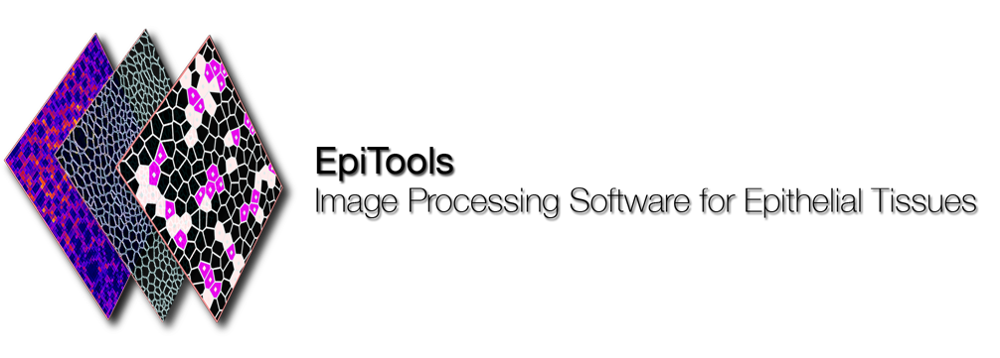
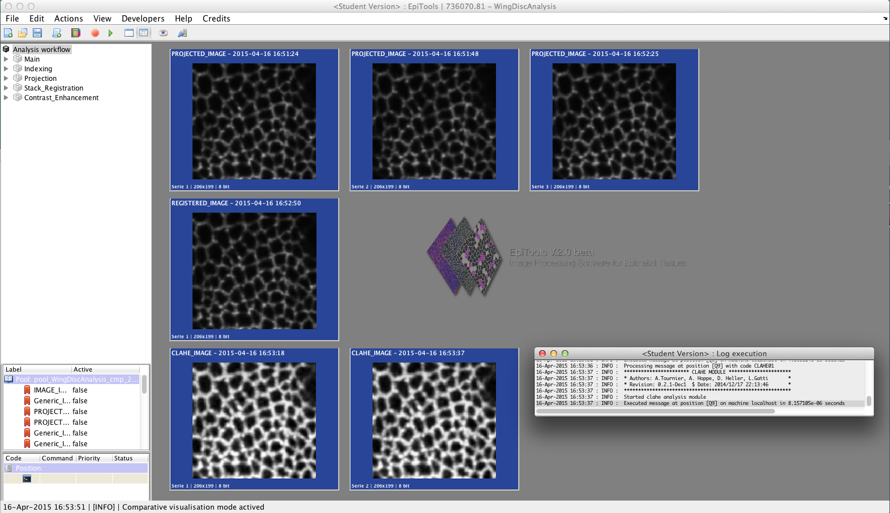

# Welcome to Epitools
---

Here we present a new software toolkit to extract the membrane signal from epithelial tissues and analyze it with the aid of computer vision. The development of EpiTools was inspired by the challenges in analyzing time-lapses of growing Drosophila imaginal discs. The folded morphology, the very small apical cell surfaces and the long time series required a new automated cell recognition to accurately study growth dynamics.

**EpiTools is composed of two main software projects to allow extended modularity**

First **an image processing application for MATLAB** to extract the membrane outlines from the experimental data, featuring:

* [Adaptive surface projection](../Analysis_Modules/00_projection)
* [A Region growing segmentation algorithm with selective seeding](../Analysis_Modules/03_segmentation)
* [Assisted Seed Correction for expert input](../Analysis_Modules/05_tracking)
* [An advanced GUI for a guided & reproducible analysis](../Quick_Guide/01_CreateAnalysisFile)

Second **a plugin collection for the <a href="http://icy.bioimageanalysis.org" target="_blank">bioimaging platform icy</a>** to interactively analyze the skeleton files, featuring:

* [A network based java data-structure to semantically describe the tissue](Icy_Plugins/02_CellGraph)
* [Automatic estraction & display of development features](../Icy_Plugins/01_CellOverlay) including:
	* Divisions and Eliminations
	* Junction rearragements (T1,T2)
	* Cell Elongation Patterns
* [Numerous Export options including Spreadsheets, GraphML and Vector Graphics](Icy_Plugins/03_CellExport)
* [Visualization and measurement of the estimated 3D gridfit surface](../Icy_Plugins/05_CellSurface)

Our projects are pulished with Open source licenses. Follow us on BitBucket!

EpiTools was published in Developmental Cell (January 2016), freely available at [http://dx.doi.org/10.1016/j.devcel.2015.12.012](http://dx.doi.org/10.1016/j.devcel.2015.12.012)

## News
---
	2016-07-22 EpiTools Icy Plugins v0.9.0
	* Fixed uncontrolled plugin shape due to new features in the EzPlug library
	* Updated descriptions for some plugins
	
	2016-04-22 EpiTools Icy Plugins v0.8.9
	* Added layer option panel for CellEditor with buttons to confirm or undo modifications
	* Added the possibility to Convert icy ROIs like rectangles&squares to CellColorTag
	* Added an import functionality for CellColorTag to use previous tags
	* Fixed missing labeling of excel sheets in EdgeColorTag
	
	2016-02-09 EpiTools Matlab: Parallel Computing Support
	* Due to a software regression the parallel computing capabilities are currently broken.
	  As consequence, please do not increase the number of processors in the input GUI.
	  We hope to re-add the support in the next release!
	* We added an FAQ section to the wiki [Support > Faq] for reported problems

	2015-12-15 EpiTools Icy Plugins v0.8.8
	* Fixed excel sheet export on EDGE_INTENSITY overlay (for single time points output file would be empty)
	* Fixed relative intensity option in EDGE_INTENSITY overlay (error on icy >= 1.7)  

View older news [here](../Support/Latest_News).

## Downloads
---

<link rel="stylesheet" href="../colorbox.css" />

MATLAB Application         |  
:-------------------------:|:-------------------------:
 |

**For best compatability we reccomend using Matlab 2014a**

visit our [F.A.Q. section](../Support/FAQ) for more details on the topic.

ICY Plugins        |  
:-------------------------:|:-------------------------:
 |

** The source code can be downloaded from our [Bitbucket](https://bitbucket.org/davideheller/epitools/) repository**

EpiTools is licensed under GPLv3 you can find the details [here](../Support/Software_License).

## Video Tutorials
---

<a href="https://www.dropbox.com/sh/ufehjrpfbgohn3x/AAACP2IIabj1u-VqWK9KnQFla?dl=0" target="_blank">EpiTools v2 Video Tutorials</a> 

<a href="https://www.dropbox.com/sh/q99vbi39ag8cwgw/AAC8W4gkb_e-T0BtCxPOXc8ga?dl=0" target="_blank">Icy Plugin Tutorials (with audio!)</a>

Make sure to download them to enjoy the HD quality 
*(click on the dots in the lower right corner and click download).*

## Who built EpiTools? 
---

##### Authors

* Davide Heller (1)
* Alexander Tournier (5)
* Andreas Hoppe (2)
* Simon Restrepo (1)
* Lorenzo Gatti (1,3,4)
* Nicolas Tapon (5)
* Konrad Basler (1)
* Yanlan Mao (6)

##### Affiliations

1. Institute of Molecular Life Sciences, University of Zurich, Switzerland
2. Digital Imaging Research Centre, Faculty of Science, Engineering and Computing, Kingston University, Kingston-upon-Thames, KT1 2EE, United Kingdom.
3. Institute of Applied Simulations, Zürich University of Applied Sciences, Einsiedlerstrasse 31a, 8820 Wädenswil, Switzerland
4. SIB Swiss Institute of Bioinformatics, Quartier Sorge - Batiment Genopode, 1015 Lausanne, Switzerland
5. Apoptosis and Proliferation Control Laboratory, Cancer Research UK, London Research Institute, 44 Lincoln's Inn Fields, London, WC2A 3LY, United Kingdom. 
6. MRC Laboratory for Molecular Cell Biology, University College London, Gower Street, London WC1E 6BT, United Kingdom

## How to cite EpiTools
---

Davide Heller, Andreas Hoppe, Simon Restrepo, Lorenzo Gatti, Alexander L. Tournier, Nicolas Tapon, Konrad Basler, and Yanlan Mao (2016). *EpiTools: An Open-Source Image Analysis Toolkit for Quantifying Epithelial Growth Dynamics*. Developmental Cell 36 (1) (January): 103–116. [doi:10.1016/j.devcel.2015.12.012](http://dx.doi.org/10.1016/j.devcel.2015.12.012)

	
## Screenshots
---

_Matlab Application v2_

_Icy Plugins_

---------------------------------------
## Support

* In case of bugs or improvement suggestions feel free to:
    * File an issue from this website clicking on the lower right corner *[Create a new issue]* .
    * Write to [Davide Heller](mailto:davide.heller@imls.uzh.ch?Subject=EpiTools)
    * Write to [Lorenzo Gatti](mailto:lorenzo.gatti@uzh.ch?Subject=EpiTools)

We use Google Analytics to study the traffic of this website. Please find information about the data usage [here](http://www.google.com/policies/privacy/partners/).

---------------------------------------
###### This page was written by [Lorenzo Gatti](mailto:lorenzo.gatti.89@gmail.com) and [Davide Heller](mailto:davide.heller@imls.uzh.ch) on 26.08.14@16:57

<!-- This contains the hidden content for inline calls -->

	

	
<strong>This content comes from a hidden element on this page.</strong>

	
The inline option preserves bound JavaScript events and changes, and it puts the content back where it came from when it is closed.

	
<a id="click" href="#" style='padding:5px; background:#ccc;'>Click me, it will be preserved!</a>

	
	
<strong>If you try to open a new Colorbox while it is already open, it will update itself with the new content.</strong>

	
Updating Content Example: 
	<a class="ajax" href="../content/ajax.html">Click here to load new content</a>

	

